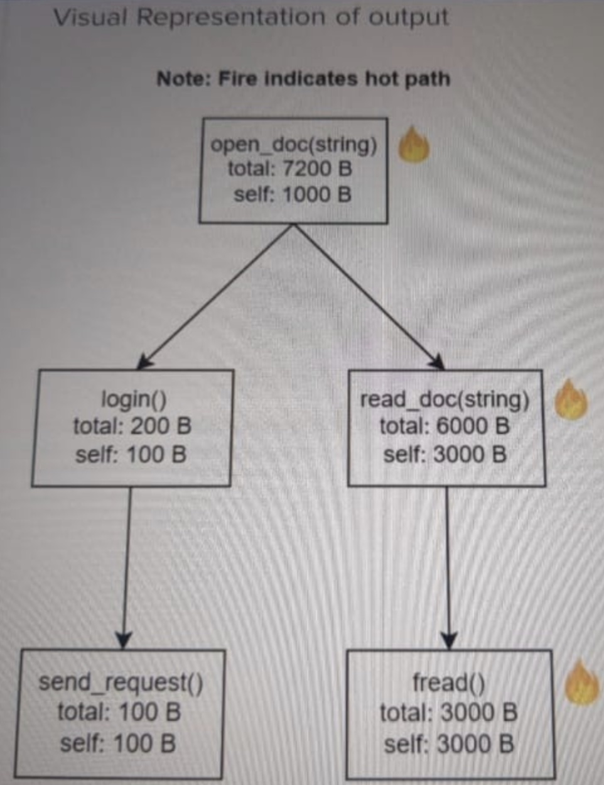

# Performance Profiler

## Problem Statement:

A software company wants to do performance analysis of its product. It is building an in-house performance profiler that parses their product's trace logs and generates memory usage performance reports. Each trace log line consists of multiple log details like the function called, bytes allocated, etc. Refer input specification for more details.

Your mission, should you choose to accept it, is to write this performance profile. The performance report should consist of the Hot path of the program.

What is a Hot Path: A hot path is a unique function call stack allocating the biggest portion of the total memory. It will be clearer from the example below.

Input Specification

1. First line contains a number L, indicating the total number of trace logs in the input.
2. Next L lines contain the input trace logs.
3. Each trace log line consists of log details separated by spaces. A log line can either be an entry or an exit log.
4. The function entry log line has the following format:
5. func entry
6. The function exit log line has the following format:
7. func exit self_mem_allocated
8. Where:

2

1. Func: A string 'F'. Indicates the function signature of the function called. The function signature won't have any spaces in it.
2. Entry/exit: A string 'E', it can have a value of 'entry' or 'exit' only. Indicates if the log entry corresponds to the entry into the function or exit from the function.
3. Self_mem_allocated: A positive integer 'M' indicating the total number of bytes allocated by this function, excluding those allocated by its nested functions.
4. Examples:
5. foo(int,bool) entry
6. send_req() exit 1235

Output Specification

1. The output must print the hot path of the call tree that allocates most of the program memory.
2. The hot path output must have the following format, with tokens separated by spaces:
3. <func_1> <total_mem_allocated_1> <func_2> < total_mem_allocated_2>
4. Where:
5. Func_N is the name of the Nth function from top in the hot path. It should be printed in all lowercase.
6. Total mem_allocated_N is the total number of bytes allocated by the Nth function in the hot path. It is the number of bytes allocated inside this function plus the bytes allocated by its nested functions.

Constraints

1. 2 <= L <= 50
2. 0 <= M <= 100000000
3. 'F' is case-insensitive

Assumptions

1. Both the entry and exit logs of each function will be present.
2. No exception traces or any other entry would be present in the logs. Only entry and exit logs.
3. It is a single-threaded program.
4. Trace logs will appear in correct order of time.
5. Only one hot path would be present.

Sample input
14
open_doc(string) entry login() entry
send_request() entry
send_request() exit 100
login() exit 100
read_doc(string) entry
fread() entry
fread() exit 1000
fread() entry
fread() exit 1000
fread() entry
fread() exit 1000 read_doc(string) exit 3000 open_doc(string) exit 1000

Output:
open_doc(string) 7200 read_doc(string) 6000 fread() 3000

Explanation

1. Following is an explanation of the input.
2. First line has the number 14, indicating that there are 14 lines in the trace log.
3. Next 14 lines have the trace logs as per specified format. For example, the first log, 'open_doc(string) entry, means that the program entered the function 'open_doc.
4. Another example is "read_doc(string) entry, which indicates that 'read_doc(string)' was called. The 'read_doc' then called the function 'fread' in a loop 3 times, before exiting with log line 'read_doc(string) exit 3000. This indicates that 'read_doc' allocated 3000 bytes of memory by itself during the function execution, excluding the 'fread' calls. The 'fread' calls each allocated 1000 bytes of memory, as shown by the 'fread() exit 1000' logs.
5. Here is an explanation of what this example program is doing:
6. The program starts in the function open_doc(). It first logs in the user using login(), then it calls read_doc() function to read the file content and render it to open the file.
7. The accompanying figure shows that there are in all 2 unique function stacks in the call tree of the program. Note that multiple calls to the fread() have been merged to create the unique stack open_doc()- >read_doc()->fread(), including adding its memory allocations from all calls. The hot path is shown as open_doc()->read_doc()->fread() because the read_doc() branch allocates the most total memory, a total of 6000 bytes,
8. Hence, the output is a single line showing the hot path of the program, with each function's total bytes allocated appearing after it. For example, the total memory allocated of 'open doc' function is 7200 bytes. The total memory allocated by fread(), including its nested fread() calls is 6000 bytes, while memory allocated only by itself is 3000 bytes.




## Solution

#### Method 1:

```java
package org.example;

import java.util.*;

public class PerformanceProfiler {
    static class FunctionInfo {
        String name;
        int selfMemory;
        int totalMemory;
        FunctionInfo parent;

        FunctionInfo(String name) {
            this.name = name;
            this.selfMemory = 0;
            this.totalMemory = 0;
        }
    }

    public static void main(String[] args) {
        Scanner scanner = new Scanner(System.in);

        // Read the number of log entries
        int logCount = Integer.parseInt(scanner.nextLine());
        List<String> logEntries = new ArrayList<>(logCount);

        // Read the log entries
        for (int i = 0; i < logCount; i++) {
            logEntries.add(scanner.nextLine());
        }

        Map<String, FunctionInfo> functionMap = new HashMap<>();
        Deque<FunctionInfo> stack = new ArrayDeque<>();

        for (String entry : logEntries) {
            String[] parts = entry.split(" ");
            String funcName = parts[0];
            String action = parts[1];

            if (action.equals("entry")) {
                FunctionInfo func = functionMap.computeIfAbsent(funcName, FunctionInfo::new);
                if (!stack.isEmpty()) {
                    func.parent = stack.peek();
                }
                stack.push(func);
            } else if (action.equals("exit")) {
                int memoryAllocated = Integer.parseInt(parts[2]);
                FunctionInfo currentFunc = stack.pop();
                currentFunc.selfMemory += memoryAllocated;
                currentFunc.totalMemory += memoryAllocated;

                if (currentFunc.parent != null) {
                    currentFunc.parent.totalMemory += currentFunc.totalMemory;
                }
            }
        }

        FunctionInfo hotPathRoot = functionMap.values().stream()
                .max(Comparator.comparingInt(func -> func.totalMemory))
                .orElseThrow();

        List<FunctionInfo> hotPath = new ArrayList<>();
        FunctionInfo currentFunc = hotPathRoot;

        while (currentFunc != null) {
            hotPath.add(currentFunc);
            FunctionInfo finalCurrentFunc = currentFunc;
            currentFunc = functionMap.values().stream()
                    .filter(func -> func.parent == finalCurrentFunc)
                    .max(Comparator.comparingInt(func -> func.totalMemory))
                    .orElse(null);
        }

        hotPath.forEach(func -> System.out.printf("%s %d ", func.name.toLowerCase(), func.totalMemory));
    }
}

```
